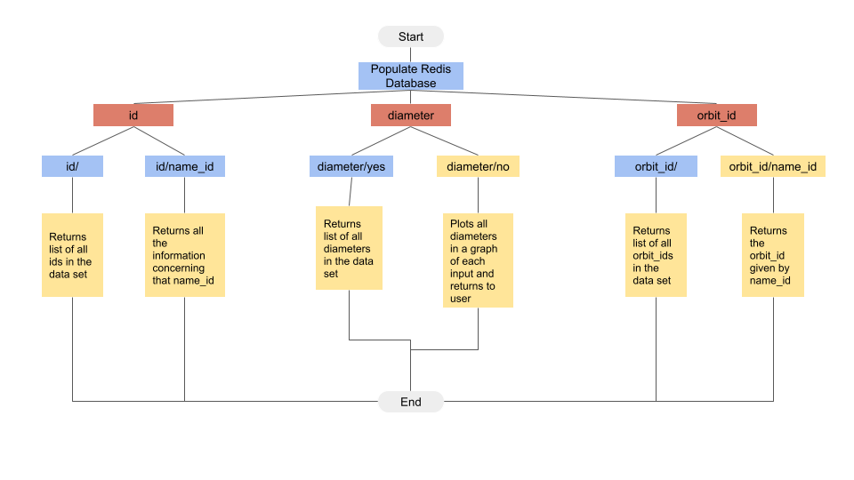

# Diagram out of this world!
---
#### What is this project about?
---
- This is a project that will be tide with the final project for this class. For the final project, my team and I are thinking of creating a flask api that works with an Asteroid data set. We are thinking of creating an API that allows the user to ask for many things, and the software should be able to return the correct items back to the user.
- As the software gets more components that will be interacting together creating a diagram of the sorts make the developers task much easier. It is also a great way for everyone to be aware on what parts need to be fixed or developed. 
- There are many diagrams out there to help visualize what needs to be done, but in this project I created a behavioral diagram that could be compared to a flow chart. There is  starting point, and there are many routes that can be taken until then end goal is reached. 
- I created a behavioral diagram that represent one of the many routes that will be implemeted to our API. It will be the starting point to help visualize the path and steps needed to succefully create the final project.

#### How does the diagram look like? 
---

- In order for this to work, the user has to store all of the data into the redis database, with the redis container running in the background. If the user does not do this step, an error will be displayed to the user.
#### What does each branch do?
---
1. id:
    -  This main branch has two sub-braches "id/" and "id/name_id". To be blunt this branch is all about returning all the name_id that is provided by the data. Or the user can input one specific name_id, and it will retrun all the information concerning that name_id. 
2. Diameter: 
    - This main branch has two sub-branches "diameter/yes" and "diameter/no". With the first option, it will return to the user a list of all the diameters that are in the dataset. The second option, it will return a graph of all the diameters that are in the data set.
3. orbit_id: 
    - This main branch has two sub-branches, "orbit_id/" and "orbit_id/name_id". With the first option it will return a list of all the orbit_ids that are in the dataset. The second option, it will return the orbit_id of the specific asteroid when the name_id is inputted.

That was just a few of the routes, that will be implemented to the final project. And with the help of the daigram from above, visualizing all the parts will make everything easier.